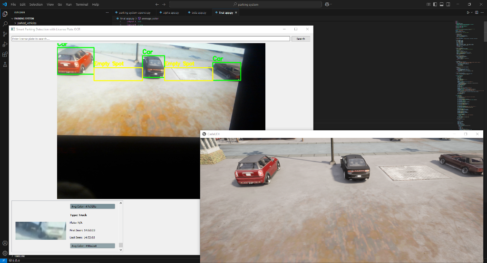

# Smart Parking Detection with License Plate OCR



## Overview

This project is a **Smart Parking System** designed to detect empty parking spots and log parked vehicle data in real-time. It leverages state-of-the-art computer vision models, specifically **YOLO v12** for object detection and **PaddleOCR** for license plate recognition.

The system is capable of detecting vehicles (cars, trucks), tracking them, reading their license plates, and estimating empty parking spots based on the spatial distribution of parked cars. Additionally, it includes a simulation script for the **Carla Simulator** to test the algorithms in a 3D virtual environment.

## Key Features

*   **Real-time Vehicle Detection**: Utilizes **YOLO v12** to accurately detect and classify cars and trucks.
*   **License Plate Recognition**: Integrates **PaddleOCR** to extract text from license plates with high accuracy.
*   **Smart Logging**: Automatically logs vehicle details including:
    *   Entry (First Seen) and Exit (Last Seen) times.
    *   Vehicle Type.
    *   License Plate Number.
    *   Average Color.
    *   Captured Image.
*   **Empty Spot Estimation**: Algorithmic detection of empty parking spaces between parked vehicles.
*   **Interactive GUI**: User-friendly interface built with **PyQt5** featuring:
    *   Live video feed with bounding boxes and overlays.
    *   Scrollable log of parked vehicles.
    *   Search functionality by license plate.
*   **Simulation Support**: Includes a script (`parking system carla simulator.py`) for running detection in the Carla Simulator environment.

## Prerequisites

*   **Python 3.8+**
*   **Dependencies**:
    *   `numpy`
    *   `opencv-python`
    *   `PyQt5`
    *   `ultralytics` (for YOLO)
    *   `paddlepaddle` & `paddleocr`
    *   `carla` (for simulation integration)

## Installation

1.  **Clone the repository** (if applicable) or navigate to the project directory.

2.  **Install the required Python packages**:
    ```bash
    pip install numpy opencv-python PyQt5 ultralytics paddlepaddle paddleocr
    ```
    *Note: For `paddlepaddle`, please refer to the [official installation guide](https://www.paddlepaddle.org.cn/en/install/quick) for your specific hardware (CPU/GPU).*

3.  **Download YOLO Weights**:
    Ensure the YOLO v12 weights file (`yolo12l.pt` or `yolo12n.pt`) is present in the project directory.

## Usage

### 1. Main Application (Webcam/Live Feed)
To run the main detection system using your default camera:

```bash
python "final app.py"
```

*   **Operation**: The application will open a window showing the camera feed. Detected vehicles will be boxed. When a vehicle leaves (after a short delay), it is logged to `parking_log.csv` and appears in the right-hand panel.
*   **Search**: Use the search bar at the top to filter logs by license plate number.

### 2. Carla Simulator Integration
To run the detection system within the Carla Simulator:

1.  Start your **Carla Simulator** server instance.
2.  Run the simulation script:

```bash
python "parking system carla simulator.py"
```

*   **Operation**: This script connects to the local Carla server (default port 2000), spawns a spectator camera, and performs object detection/parking spot estimation in the 3D world.

## Project Structure

*   `final app.py`: The main application code containing the GUI, YOLO inference, OCR logic, and logging system.
*   `parking system carla simulator.py`: Script for integrating with the Carla Simulator.
*   `parking_log.csv`: The CSV file where parked vehicle data is stored.
*   `parked_vehicles/`: Directory where images of detected vehicles are saved.
*   `yolo12l.pt`: Pre-trained YOLO v12 model weights.

## Troubleshooting

*   **Webcam Error**: If `final app.py` fails to open the camera, check your camera permissions or change the `cv2.VideoCapture(0)` index.
*   **OCR Accuracy**: Performance depends on image clarity. Ensure the camera is focused and lighting is adequate.
*   **Carla Connection**: Ensure the Carla server is running before executing the simulator script.
